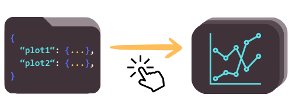

# Q-voter model generator


[](./LICENSE)

## Table of contents

- [Q-voter model generator](#q-voter-model-generator)
  - [Table of contents](#table-of-contents)
  - [Description](#description)
  - [Usage](#usage)
    - [Quick guide](#quick-guide)
    - [More options](#more-options)
  - [JSON specification file](#json-specification-file)
    - [Rules](#rules)
      - [Parameter groups](#parameter-groups)
        - [Plot params](#plot-params)
        - [Net params](#net-params)
        - [Model params](#model-params)
        - [Method params](#method-params)
      - [Group param dict](#group-param-dict)
      - [Value types](#value-types)
    - [Example](#example)
  - [Networks](#networks)
    - [Barabasi-Albert](#barabasi-albert)
    - [Watts-Strogatz](#watts-strogatz)
    - [Complete](#complete)
    - [Real - Facebook](#real---facebook)
  - [Important notes](#important-notes)
  - [Technologies](#technologies)
  - [Project structure](#project-structure)
  - [Author](#author)

## Description

This app serves as a handy tool to create **exit time** and **exit probability** plots for **$q$-voter model**[^1] on different parameter sets, including networks. It comes with a predefined set of graphs and an automatically managed, efficient simulating system.

Why it is powerful?

- It provides super **simple interaction**, auto simulations and plotting.
- **Data storage and management** allows to reuse the simulation results.



Just specify the required plots in a JSON file, open the app, and forget about the other tedious steps!

On output, you will get the folder with *.pdf* plot files and the *.tex* embedding them along with the descriptions (currently in Polish, but configuration is possible).

[^1]: Details introduced in C. Castellano, M.A. Munoz, R. Pastor-Satorras, [*The non-linear q-voter model*](https://arxiv.org/abs/0907.1775)

## Usage

### Quick guide

1. Make sure you have installed both **Python** and **Julia** on your device (and added to path). The stable versions used by the app are specified in the [technologies](#technologies) section.
2. Open the `q-voter.bat` script. If using **CMD**, type

   ```batch
   chdir your\path\to\q-voter-generator
   q-voter
   ```

    Note that you can even add the app directory to PATH and always skip the direcory change, executing just

    ```batch
    q-voter
    ```

3. The script will ask to open a specification file. Use this option and create the plot specification file sticking to the guidelines from the [JSON specification file](#json-specification-file) section.

### More options

If you are using the app for the first time, execution might take longer, for it automatically sets up environments and installs packages for both Python and Julia.

There are some additional script options. You can check their description by calling help:

   ```batch
   q-voter -h
   ```

## JSON specification file

### Rules

The file must contain one dictionary which elements are sub-dictionaries defining specifications for each plot. Keys for sub-dictionaries must be **unique** and **alpha-numeric**! Moreover, don't use `"__ARGUMENTS__"` &  `"__VALUES__"` param names. They are reserved internal columns.

#### Parameter groups

Inside the sub-dictionary, you can pass parameters. Some of them are required, others optional.

##### Plot params

- `"plot.args"` (*required*) - arguments on the plot. It must be the key of one of the other parameters (net or model).
- `"plot.vals"` (*required*) - values type on the plot:
  - `"avg_exit_time"` for average exit time,
  - `"exit_proba"` for exit probability.
- `"plot.group"` (*optional*) - parameter indicating plot series. It must be the key of one of the other parameters (net or model).
- `"plot.desc_info"` (*optional*) - additional text info added to the plot description.
- `"plot.x_ax_scale"` (*optional*) - argument axis scaling:
  - `'linear'` (*default*),
  - `'log'`.
- `"plot.x_ax_scale"` (*optional*) - value axis scaling. Options as above.

##### Net params

- `"net.net_type"` (*required*) - network type. One of the keys from the [networks](#networks) section.
- `"net.size"` (*required*) - number of the network nodes.
- `"net.*****"`  (*optional/depends on the model*) - ...all the other net params, sticking to the [networks](#networks) common convention.

##### Model params

- `"model.x"`  (*required*) - initial proportion of opinions.
- `"model.q"` (*required*) - number of neighbors affecting agent's decision each time.
- `"model.eps"`  (*required*) - noise level from 0 to 1.

##### Method params

- `"method.mc_runs"` (*required*) - number of Monte Carlo runs to take mean from.

#### Group param dict

If the arguments need to be different for each series, you can use `"groups: { ... }"` parameter. Inside it, there is a list of cases, where each case is a small dictionary with two values: the one used as an argument and the other indicating a series.

#### Value types

Net or model params (also in the `"groups"` env) be passed in three modes:

- single value mode: string or number (eg. `"model.x": 0.5`),
- list mode: a list of values (eg. `"model.x": [0, 0.25, 0.5]`),
- range mode: a special range dict containing start, step, and stop values (eg. `"model.x": {"start": 0, "step": 0.1, "stop": 1}`).

However, list and range mode can be used **solely** for the parameters serving as `"plot.args"` and `"plot.groups"`. Other parameters must be single values.

Additionally, for model and net params, plus plot values and arguments, you can use *compound variables* - eg. to get scaled $T/N^2$ on $y$ axis. They can be built by passing a dict, like `{"params": ["avg_exit_time", "size", 2], "operations": ["/", "^"], "order": [1, 0]}`. However, you have to stick to the folowing guidelines:

- all three arguments must be lists,
- `"params"` (*required*) - contains either other column names (**without `xxx.` prefixes**) or numbers,
- `"operations"` (*required*) - a sequence of two-argument operations (therefore, must be shorter by 1 than `"params"`). Currently supported ones are: `/`, `*`, `^`, `//`,
- `"order"` (*optional*) - indices (starting from 0) corresponding to the operations and indicating eval order; by default `"operations"` are performed in the original order and **standard priority is neglected** - you have to manually specify the order.

### Example

Here is the example specification dictionary with some comments. You can compare it to the rules above.

```python
{   
    # FIRST PLOT
    "firstSamplePlot": {
        # values related to the plot
        "plot.args": "model.x", 
        "plot.vals": "exit_proba",
        "plot.group": "model.q", # for only one group does not add this row
        # values related to the network
        "net.net_type": "BA",
        "net.size": 200,  # * single number value type
        "net.k": 1,  # * single number value type
        # method related value
        "method.mc_runs": 1000, # without this line, 1000 is taken on default
        # values describing the model
        "model.x": {
            # * range value type
            "start": 0,
            "step": 0.1,
            "stop": 1
        },
        "model.q": [
            # * list value type
            1,
            2,
            3
        ],
        "model.eps": 0.1
    },

    # SECOND PLOT
    "secondSamplePlot": {
        "plot.args": "net.size",
        "plot.vals": "avg_exit_time",
        "plot.group": "model.eps",
        "net.net_type": "C",
        "model.x": 0.5,
        "model.q": 4,
        # no eps & size specified before!
        "groups": [
            # it's possible to get separate sizes for each eps
            {
                "model.eps": 0.1,
                "net.size": [
                    10,
                    20,
                    50,
                    70,
                    100,
                    200,
                    500,
                    1000,
                    5000,
                ]
            },
            {
                "model.eps": 0.23,
                "net.size": [
                    10,
                    20,
                    50,
                    70,
                    100,
                    200,
                    500,
                    1000
                ]
            }
        ]
    }
}
```

## Networks

Only the models predefined in [`qvoterapp/jlhelpers/models.jl`](qvoterapp/jlhelpers/models.jl) can be used. In the last definition, there is a dictionary of models' *key names*. Users should also stick to this convention of naming when creating new models.

Existing network models along with their parameters are:

### Barabasi-Albert

(*key name*: **BA**, *wiki*: [link](https://en.wikipedia.org/wiki/Barab%C3%A1si%E2%80%93Albert_model))

**WARNING:** In this model, some combination of parameters can generate isolated nodes. To avoid this undesired (for q-voter model) situation it is assumed that `n0 = k`!

- `N` - number of nodes.
- `n0` - initial number of nodes in the algorithm.
- `k` - number of connections for each new node.

Order of parameters in the file: `N,k`.

### Watts-Strogatz

(*key name*: **WS**, *wiki*: [link](https://en.wikipedia.org/wiki/Watts%E2%80%93Strogatz_model))

- `N` - number of nodes.
- `k` - average degree of the node (**if odd, an algorithm takes `k = k - 1`**).
- `beta` - the probability of rewiring.

Order of parameters in the file: `N,k,beta`.

This algorithm can create in particular a one-dimensional ring when given `k=2` and `beta=0`.

### Complete

(*key name*: **C**, *wiki*: [link](https://en.wikipedia.org/wiki/Complete_graph))

- `N` - number of nodes.

Order of parameters in the file: `N`.

### Real - Facebook

(*key name*: **FB**, *source*: [link](https://snap.stanford.edu/data/ego-Facebook.html))

- `N` - number of nodes. Only selected values available:

  $N \in (40, 44, 148, 168, 224, 324, 532, 744, 775, 1033)$.

Order of parameters in the file: `N`.

This one uses largest connected components of the real social networks, based on the Facebook anonymized data.

## Important notes

- Float **precision** standard for the app is **3 digits**.
- Average exit time uses `avg_exit_time` variables and exit probability - `exit_proba`.

## Technologies


The main batch file calls a Python script in a virtual environment. However, simulations are performed in multiple processes by Julia on each available CPU. For communication, the *PyJulia* module is used. Lastly, plots are created by *Seaborn*.

The newest tested versions for stable performance are:

- **Python 3.9.7**
- **Julia 1.6.1**

## Project structure

The main project folder contains the Python requirements (`requirements.txt`), batch scripts described in [usage](#usage) section (`auto-q-voter.bat`, `q-voter.bat`), and the `qvoterapp` application directory. Except for that it will be placed for `data.xml` base (**do not modify it!**), input specification files - as `plot.spec.json`, and virtual environment files.

When it comes to `qvoterapp`, it can be divided into the Julia module(`jlhelpers`), Python module (`pyhelpers`), standalone Python script (`qvoter.py`), generated text configuration (`text.config.json`), Julia real network data[^2] in `net_images.jld`, and Julia package provider (`packages.jl`). The external scripts will utilize all of them, so for basic usage you don't have to worry about this part.

[^2]: Data is saved as a dictionary of numbers and corresponding `SimpleGraph` objects.

## Author

The project was created by [Mateusz Machaj](https://github.com/o-Mateo-o) as a tool supporting research related to his bachelor's thesis at the Faculty of Pure and Applied Mathematics, Wroclaw University of Science and Technology.
